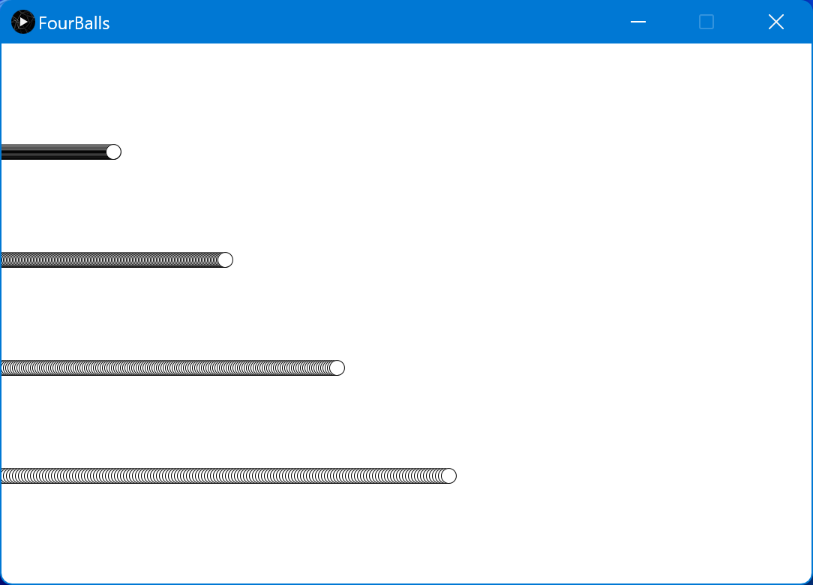

### Four Balls Procedural

### Four balls bouncing around the screen

### Output

### How to run the code:

- Clone the repository
- Make sure to change `flatDir` location to the core.jar in `build.gradle` file
- Run the project.
